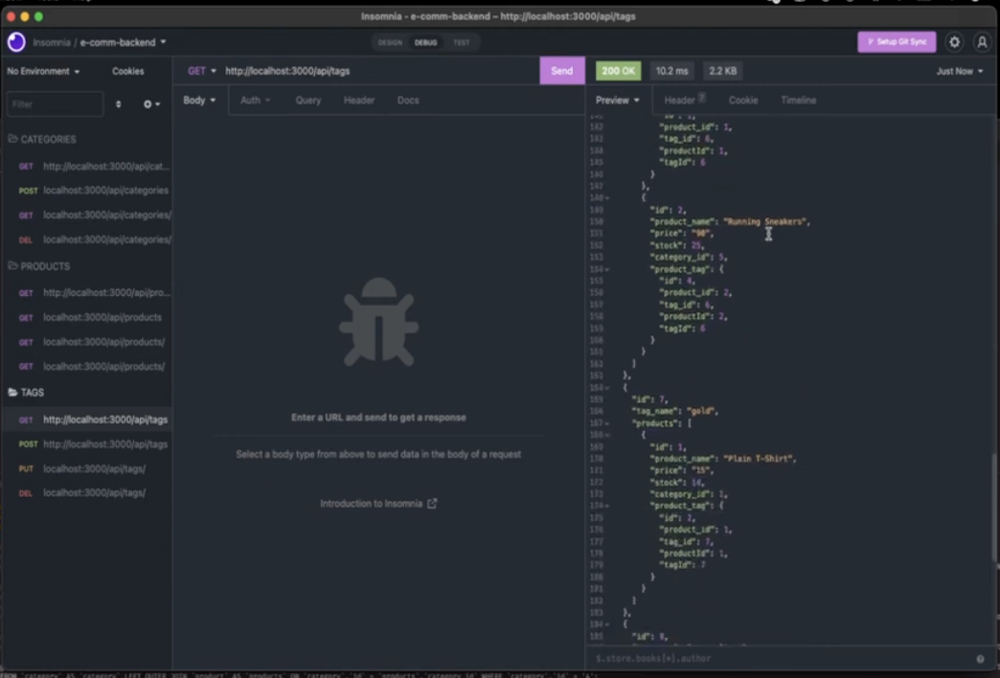

<h1> E-commerce Back End </h1>
<h2> Description </h2>

 A back end implementation for an E-commerce platform utilizing <code>Node.js</code>, <code>Express.js</code>, and <code>MySQL2</code> on a local MySQL database. <code>Dotenv</code> is used to store sensitive information. 

<h2> Table of Contents </h2>

Table of Contents

<ol>
<li><a href='#installation'>Installation</a></li>
<li><a href='#usage'>Usage</a></li>
<li><a href='#contribution'>Contribution</a></li>
<li><a href='#tests'>Tests</a></li>
<li><a href='#questions'>Questions</a></li>

## <h3 id='installation'>Installation</h3>

 Clone this repo to your local device then run the command <code>npm i</code> 

## <h3 id='usage'>Usage</h3>

 To use, run <code>npm run seed</code> in the command line to seed the database then run <code>node server.js</code> to start a local host server. 

Youtube Link: <a href='https://youtu.be/APNQ49mH9dU' target='_blank'> E-commerce Back End Walkthrough</a>

## <h3 id='contribution'>Contributing</h3>

 This project is considered complete, therefore no contributions are necessary. 

## <h3 id='testing'>Tests</h3>

 Testing was not needed for this project. 

## <h3 id='questions'>Questions</h3>

Have questions? Please feel free to reach out to me on github at <a href='https://github.com/skcruzer'target='_blank'>skcruzer</a> or by email at <a href='mailto:seankennethcruz@gmail.com'target='_blank'>seankennethcruz@gmail.com</a>.

- - -
© 2022 Skcruzer, Inc. All Rights Reserved.